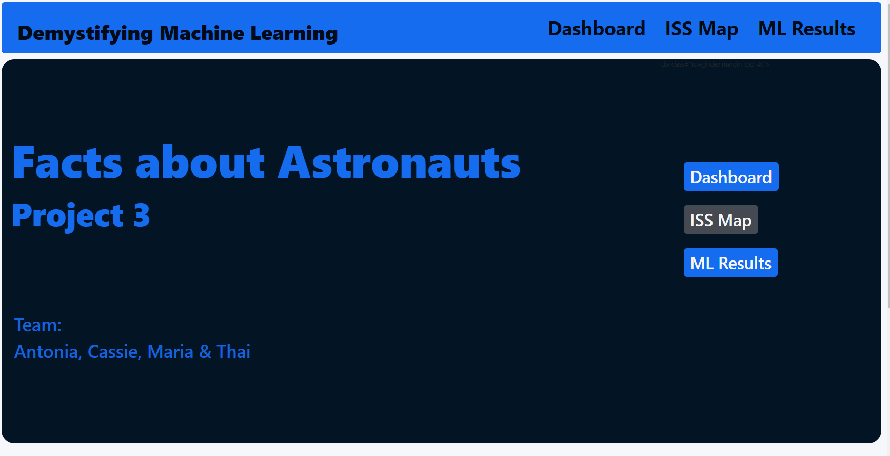
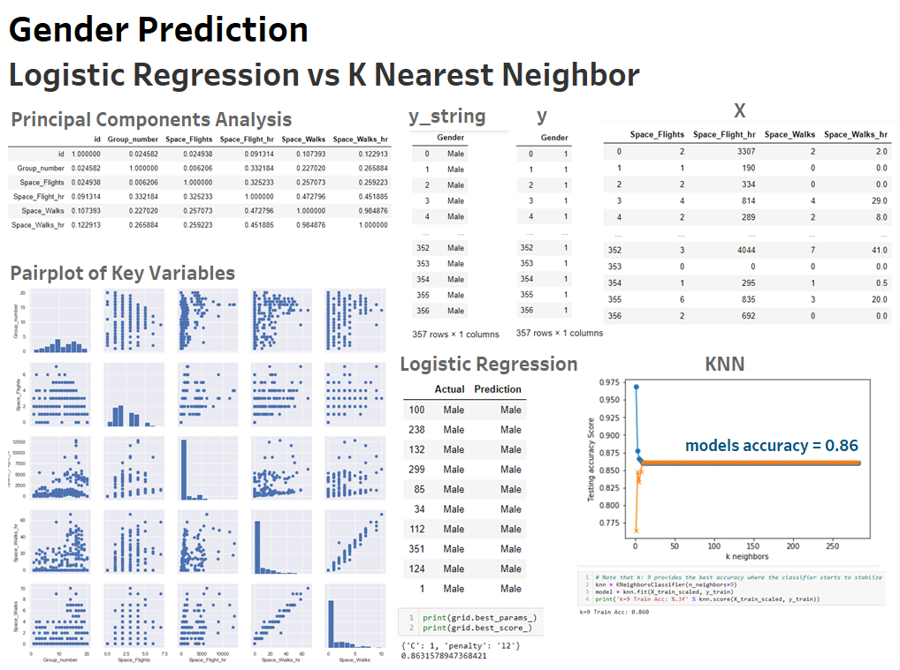
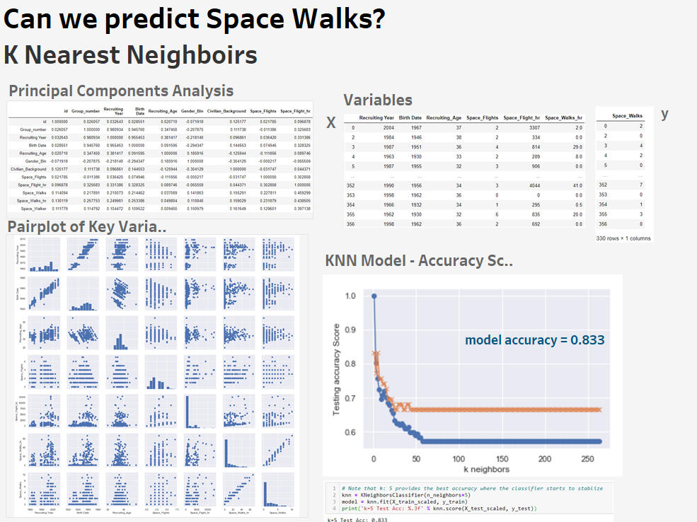
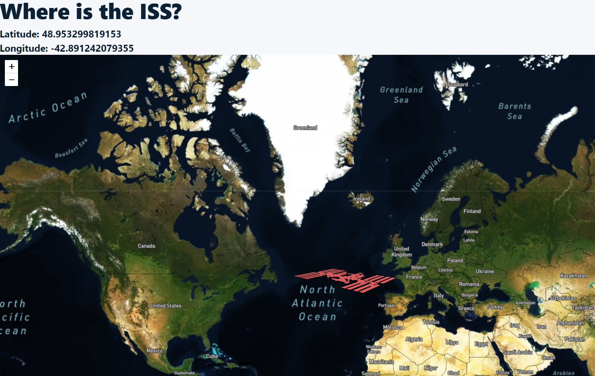

# Final Certification Project
We created an analysis of existing data to make a prediction on Astronauts' Gender, Status and Space Walks, using machine learning modeling.

Our home page shows the inspiration, topic and scope of our project. 

### Our data source:
* https://www.kaggle.com/nasa/astronaut-yearbook/data#

## Visualization Technologies:
We used 9 visualization technologies to carry out our project:
• Python Pandas
• Python Matplolib
• Seaborn
• Scikit-Learn
• Tableau
• HTML/CSS/Bootstrap
• Leaflet
• JavaScript Flask
• Amazon AWS

Please take the time to go through this website and its correspondent AWS deployment:

## Deployment link in AWS
* http://project3-env-1.eba-2p6vdmpb.us-east-2.elasticbeanstalk.com/

## Here you can check our Machine Learning results:

## Where is the ISS?
We additionally set up the life location of the ISS!

